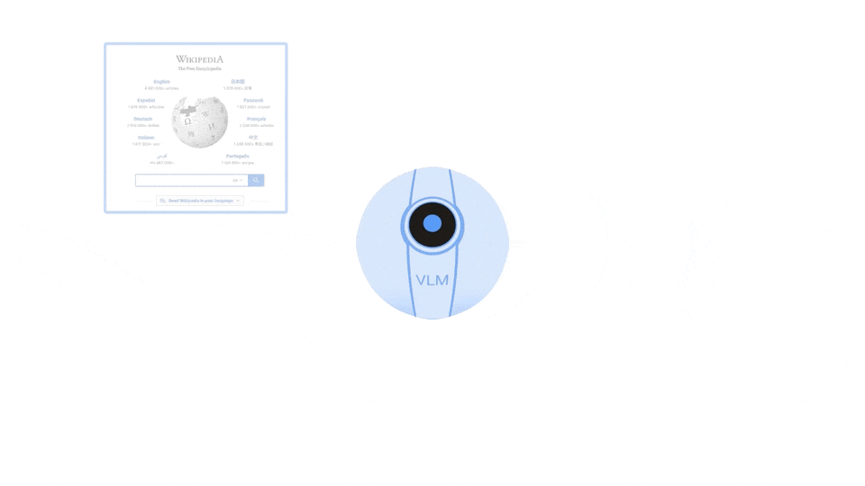

# 探索AGI系列 | 01. LLM不等于通用人工智能望周知

---

## 前言

大语言模型的出现重新激发了人工通用智能（AGI）研究的兴趣。小编试图搜索一些国内大厂在AGI方面的布局，搜出来的文章大多都是在总结国内大厂在”百模大战“中发布的各自的大模型，benchmark一般都在对标ChatGPT。仔细调研这些大模型的技术细节，有些行业大模型确实有可圈可点的思想值得借鉴。然而，需明确一点：大型语言模型（LLM）并非AGI的代名词。AGI是一个由来已久的研究方向，LLM的成功只是说在很大程度上让AGI向前迈了一大步。

小编自今年2月开始至今一直从事大语言模型应用层的开发，包括对已有AI模型（CV，NLP）的AGI化，大模型微调，RPA+LLM等，对于大模型和AGI领域小编有一些独到的想法。尽管AGI最终的架构目前还没有一个定论，小编希望能在这个系列中与大家分享个人对于AGI的认知和想法，一来可以起到抛砖引玉的作用，二来也希望做一个记录，未来可以回过头来对现在的想法进行验证。

因为小编还是一个在职工程师，所以更新频率大概在一个月一次。欢迎大家关注我，也欢迎大家积极在评论区和我讨论你的想法。

## 如何定义AGI

AGI是Artificial General Intelligence的缩写，中文是“通用人工智能”。通用人工智能被认为是AI的最终目标，AGI研究强调智能的通用性质，采取综合性的观点，并旨在构建与人类智能相媲美的人工智能。这使得AGI与主流的人工智能研究有所不同，后者侧重于特定领域的方法。AGI与“强人工智能”、“人类水平的人工智能”等概念相关。

尽管在将人类智能复制到计算机中方面存在共识，但AGI项目的目标各不相同。它们试图在不同的层次上复制人类智能：

1. **结构：** 复制大脑结构以尽可能真实地模拟智能。
2. **行为：** 通过模拟人类类似的行为来展示智能。
3. **能力：** 通过解决问题的能力来评估智能。旨在解决人类可以解决的问题。
4. **功能：** 用计算机模拟一系列认知功能组件，例如感知，推理，学习，行为，交流，问题解决等。
5. **原则：** 将智能与合理性或最优性联系起来，根据奖惩机制，以最优性决定行为。

这些观点在不同的抽象层次上描述了人类智能，旨在在计算机中复制它们。然而，它们在细粒度和范围上存在差异，使它们相关但又不同。每种方法不一定与其他方法一致。

在AGI中，“通用性”的概念随着时间的推移已经有了不同的解释，例如解决所有问题、解决所有人类可解决的问题、解决所有可计算问题、尝试解决所有可表示的问题。

## 问题： LLM就是AGI吗？

从**行为**和**能力**角度上说，当前的大语言模型，例如ChatGPT，Claude，文心一言甚至一些开源的6B，13B大语言模型，已经能够让使用者通过***描述目标问题***，达到解决通用问题的目的。

然而LLM在解决问题的过程中近似于一个“黑盒”，对于其给出的答案的可靠性我们并无从考证。不仅如此，对于同一个问题，尽管我们可以通过设置temperature值来控制其输出结果出现变化的程度，但还是无法百分百保证每次都能输出相同的，正确的答案。另外，由于LLM具备的知识是通过训练以权重的形式保存在模型中，我们很难通过修改一部分权重来精确更新知识。

LLM最根本还是一个生成式的语言模型，其基于上下文的推理能力并没有融合世界知识。大语言模型的本质是通过统计建模在大量文本上进行训练，学习文本之间的语言学相关关系，从而根据上个词汇预测下个词汇。用北京通用人工智能研究院朱松纯教授团队的话来说，大模型无异于缸中之脑，因为大模型本身并不在真实世界中，它无法像人一样实现从”词语“到”世界“的联结。缺乏符号落地使得大模型很容易陷入“绕圈圈”的境地。

从多模态信息的处理上来看，尽管基于CLIP，BLIP等多模态-文本embedding算法，多模态大模型也有了很多比较成功的案例，例如ChatGPT4， MiniGPT4等，从准确度来说，基于大语言模型的多模态大模型是差强人意的。就拿CV方向的模型来说，传统的CV任务，包括图像识别，追踪，注释，生成等都是基于截然不同的网络架构实现的。比如说，对于图像识别和分割任务，我们通常依赖于head-modules + backbone-modules，用多模态大模型，无论prompt如何设计，准确度都难以企及。当然CV界确实有很多大一统架构的方向，基于CLIP,BLIP+prompt的架构也是其中的一个方向，除此之外还有一些诸如open-world visual recognition, segment anything task, generalized visual encoding等等，但就目前而言还没有一个定论。除了图像以外，声音，感知，动作等都属于多模态的范畴。

简单来说，大语言模型的不可解释性以及有限的持续学习能力（知识修改、知识更迭、自主学习）是其最大的弊端。加之其生成式语言的本质以及在多模态信息处理能力上的不足，就大语言模型本身而言，还远不是AGI的一个最终解。我们所期待的是一个以足以媲美人类的认知能力来解决任何任务的自主智能体。

## AGI需要权衡的方面

OpenAI官网上对于AGI的Roadmap中，阐述了OpenAI对于AGI的长远和短期目标。小编再结合上面的问题以及一些其他研究论文，引出如下一系列AGI需要权衡的方面：

1. 可解释性
2. 普适性
3. 知识迭代
4. 与世界知识的结合
5. 多模态
6. 自主学习能力
7. 算力
8. 监管

## 一些AGI的成果和愿景

### Deepmind

RT2: DeepMind公司的Robotic Transformer 2（RT-2）是人工通用智能（AGI）领域的重大突破。RT-2是一种创新的视觉-语言-动作（VLA）模型，它结合了来自网络和机器人的数据，为机器人控制提供了通用指令。其创新之处在于能够弥合在大规模网络数据集上训练的高容量视觉-语言模型（VLM）与机器人控制的实际需求之间的差距。通过适应Pathways Language and Image model（PaLI-X）和Pathways Language model Embodied（PaLM-E），RT-2将视觉和语义理解与机器人动作相结合。RT-2的独特之处在于其出色的泛化能力。它超越了对机器人数据的暴露，展示了语义理解和多阶段推理的能力。它能够解释新颖的指令，并展示了基本的推理能力，如辨别物体类别和高层描述。值得注意的是，通过“思维链”推理，RT-2能够执行复杂任务，规划和执行一系列动作，展示了前所未有的能力。通过广泛的定性和定量实验，RT-2展现了其技能的出现。它能够理解和执行涉及未见过的物体、背景和环境的任务，相较于之前的模型，泛化性能提升了3倍。它在模拟和真实世界情境中都表现出色，展示了其适应性和稳健性。总之，RT-2展示了视觉-语言模型在实现AGI方面的转变潜力。

### OpenAI

OpenAI的产品应该是我们都比较熟悉的。ChatGPT3.5是最初爆火的一款基于对话的通用语言模型。之后的ChatGPT4.0更是优化了其对于图像模态数据的支持。ChatGPT4.0支持的插件模式，让大语言模型具备了使用工具和专家系统的能力。网传GPT4.0采用了MoE混合专家模型，通过把一个任务拆解成子任务，用Gating Model来决定使用哪一个专家模型来处理子任务，最终池化以得出最终答案。不管网传是否为真，运用大语言模型驱动专家模型（或者工具），鉴于专业领域narrow AI model比通用模型更优的表现。在小编看来是一个很不错的AGI思路。

从OpenAI官网对于AGI的Roadmap我们还能获得的重点是关于AI伦理角度的。在AGI技术实现的道路上，同样不能忽视其治理方面的问题，包括滥用风险，严重事故，可能的社会动荡，利益分配等。Anthropic, Google, Microsoft, OpenAI都创立了Frontier Model Forum（前沿模型论坛）。该论坛的目标是：（i）推进AI安全研究，促进前沿模型的负责任发展，最大程度地减少潜在风险；（ii）确定前沿模型的安全最佳实践；（iii）与政策制定者、学者、公民社会等共享知识，推进负责任的AI发展；以及（iv）支持利用AI解决社会最大挑战的努力。

### AutoGPT,AgentGPT,BabyAGI,HuggingGPT,MetaGPT

这些开源项目都是利用自治的思想，通过使用大模型拆解任务，形成子任务，通过自我规划、评测一步一步完成子任务，并最终完成用户提出的需求。这些项目在解决普适问题的能力上是十分接近AGI的。这几个项目，除了MetaGPT是最近（7月）发布的以外，都已经开源了很久了，小编大概三月的时候就有部署过这些项目，也阅读了他们的源码，最终看到了一些***认知模型（cognitive model）***的影子。这些项目打动小编的不是其落地解决问题的能力，真正打动我的是其中体现出来的思维过程。小编坦言，从使用体验来说，这些项目不仅过程耗时久，成本高，在稳定性上也有很大的缺陷。但这些项目提供了一些新的努力方向，起码小编看到当前的流程中尽管使用了Working Memory, 状态评估等思路，但也不是最优的使用方式。认知模型的研究可以追溯到1950年，是最早的对于AGI的研究领域，*现有的认知模型有将近200种*，小编认为，通过选择和优化认知模型，结合大模型，我们能够在AGI的道路上迈进一大步。

## 认知架构（Cognitive architectures)

认知架构（Cognitive Architecture）是通用人工智能（General AI）研究的一部分，起源于20世纪50年代，旨在创建能够在不同领域进行问题推理、开发洞察力、适应新情境并进行自我反思的程序。类似地，认知架构研究的最终目标是建模人类思维，从而使我们更接近构建人类水平的人工智能。认知架构试图提供证据，证明特定机制成功产生智能行为，从而为认知科学做出贡献。此外，认知架构的工作体系以及这个综述记录了以前尝试过的方法或策略，以及它们是如何使用的，取得了多大的成功或者得到了哪些教训，这些都是指导未来研究工作的重要元素。

认知架构旨在实现人类思维模型，以便更好地理解和实现人类级别的人工智能。认知架构尝试通过模拟人类智能行为来提供证据，以表明特定机制能够产生智能行为，从而为认知科学做出贡献。认知架构的研究目标、结构、运作方式和应用存在分歧，不同的架构追求不同的智能模型和行为。

## 常见的Cognitive architectures

一些常见的认知架构包括**Soar、ACT-R、LIDA、CLARION、CAPS**等。一般来说，认知架构分为三种：1）Emergent 2）Hybrid 3）Symbolic, 其对应还有细分类型，Emergent 可以分为Connectionist和neuronal modeling； Hybrid可分为fully-integrated 和 symbolic sub-processing。

认知架构定义和规划了如下几个方面：

- 感知 perception
  - Vision
  - Vision using physical sensors
  - Simulated vision
  - Audition
  - Symbolic input
  - Multi-modal perception
- 注意力机制 Attention
- 行为选择 Action selection
  - Planning vs reactive action
  - Dynamic action selection
- 记忆机制 Memory
  - Sensory memory
  - Working memory
  - Long-term memory
  - Global memory
- 学习能力 Learning
  - Perceptual learning
  - Declarative learning
  - Procedural learning
  - Associative learning
  - Non-associative learning
  - Priming
- 理解能力 Reasoning
- 元认知 Metacognition

## 本章小结

本章从大型语言模型（LLM）与AGI的区别入手，强调了LLM不等同于AGI，而只是AGI发展中的一部分。对于AGI，小编认为应当**将LLM与Cognitive Architecture结合，用LLM赋能认知架构**。在下一期，我们将详细探索认知架构这一领域。读到这的读者，如果您从笔者的分享中有所收获，或者有不同的看法，欢迎在评论区与我互动！**点赞收藏关注不迷路！您的支持是小编前进的动力！**
