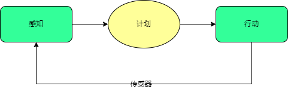
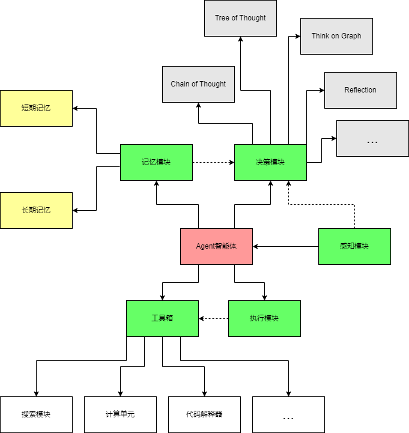
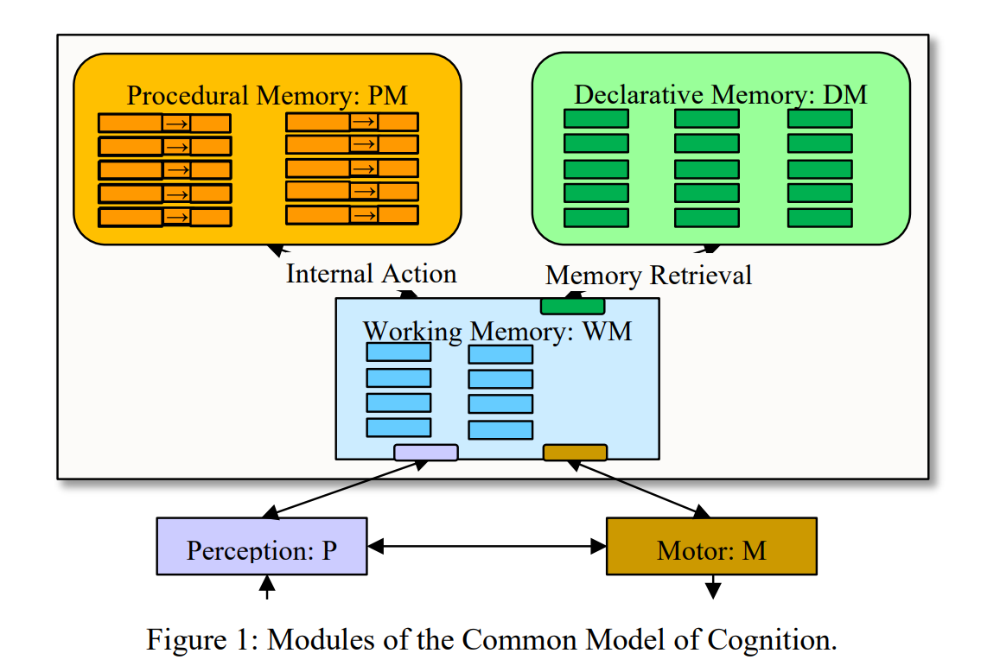
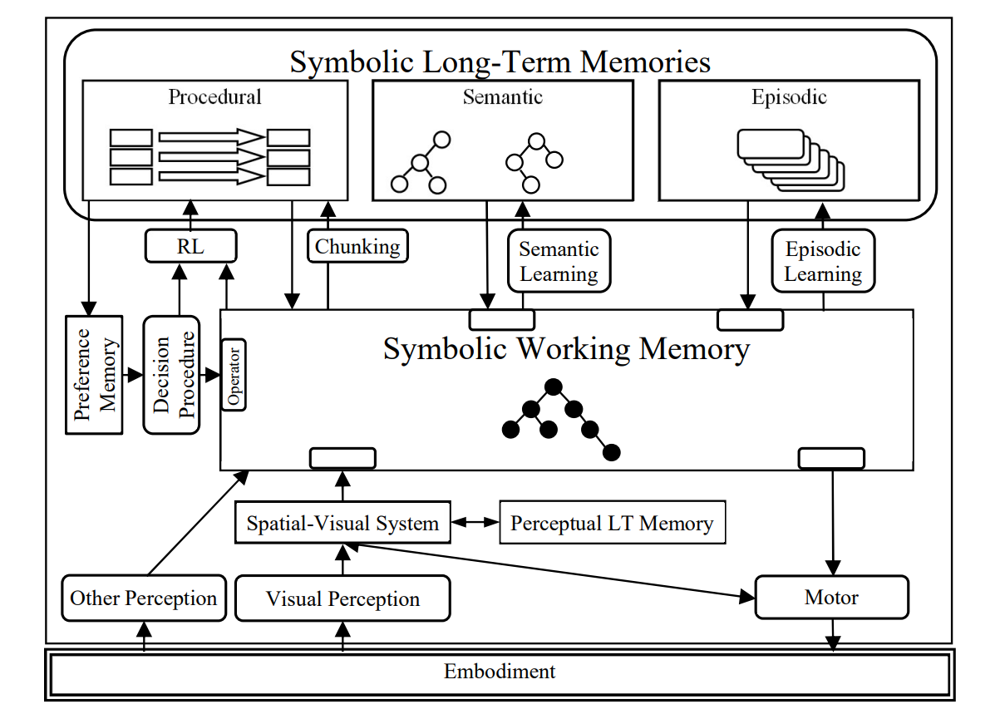

# 探索AGI系列 | 02. 智能体方法论：Agent智能体 & 认知架构（Cognitive Architecture）

---

## 前言

在上一章，笔者对于通用人工智能（AGI）和LLM的区别和联系进行了一系列的介绍。相信读者朋友们对AGI已经有了一个比较清晰的认知。在本章，笔者将为大家简单介绍一下Agent智能体的概念。搞过LLM应用开发的朋友们肯定对Agent的概念不陌生，Agent在LLM爆火之初就有了几个比较不错的案例，例如HuggingGPT, AutoGPT, 斯坦福开发的类似“西部世界”的Agent小镇等等。很多朋友会说这些项目从成本，效率等角度上来说都没有落地的可能性。这点笔者很赞同，但从这些项目的源码思路角度上还是有很多值得借鉴和进一步推敲的地方。究其根本落到三个字————方法论。笔者结合自己的开发经验认为：

> Agent智能体的架构设计方法论就是认知模型。

AutoGPT和HuggingGPT在二，三月开源的时候小编就在自己的设备上部署过，正如绝大多数人的反馈，耗时久，token消耗高，生产过程也不稳定（容易卡死）。不过在当时其实笔者对其产能本就没有很高的期待，笔者最欣赏的是其架构和解决问题的通用思路，AutoGPT接到任务后，会对任务进行规划和拆解，形成子任务，在运行过程中根据对现阶段任务的完成度进行评估，动态调整子任务的生成，是一个动态规划的过程，当然，对中间状态的存储也很自然的让开发者设计出了存储模块。在那时候，借鉴了这些项目的思路，笔者便开始构建一系列的LLM应用。利用Langchain，笔者对于公司业务中已有的NLP接口进行封装，实现了BI分析的智能规划，简单来说就是用户提出问题，我们自主调度现有的”工具“（AI算法，计算模块，搜索模块等）解决问题。

在小半年的迭代开发过程中，笔者在AI自治程度，产品稳定性和总体成本间反复横跳，慢慢的意识到方法论的重要性。

本章先带大家抽丝剥茧，了解一下什么是Agent以及现阶段落地瓶颈，相信阅读完之后读者朋友们能跟我有所共鸣。

## Agent智能体

> 寒武纪，距今5.4亿至3.6亿年前，见证了地球上生命的巨大进化飞跃，从简单的单细胞生物跃升至更高层次的存在，如三叶虫、海绵和脊索动物，这一时期被称为"寒武纪生命大爆发"。

如今，我们正站在智能体领域的新寒武纪之门，其中的主角是"Agent"智能体。

就像寒武纪时代大地上不断涌现出新的生命形态一样，现代的Agent智能体在智能技术领域迎来了令人振奋的大爆发。这些Agent智能体，如BabyGPT、AutoGPT、Generative Agents等实验性产品，正在以前所未有的方式改变着我们与技术互动的方式。

随着国内大语言模型百模大战进入尾声，各大厂商已经开始相继推出自己的Agent产品。在这笔者就不列举案例了因为并没有实测过效果，但我们起码可以得到的一个信号，Agent智能体开发是当下的风口。如果能从方法论的角度思考问题，能帮助我们更好的找准优化的方向。

### Agent智能体是什么

Agent智能体是以LLM为“大脑”，能够自主理解问题，规划决策，执行任务的智能体。笔者认为，Agent的终点就是AGI，衡量Agent能力的一大标准就是“自治度”。

Agent和ChatGPT这种大语言模型的区别在于，Agent要做到的就是自动的对“怎么做”进行规划，利用手头的工具，一步到位解决用户的问题。

### Agent基础体系架构

最优的Agent架构应当是怎么样的并没有一个定论，肯定是跟业务场景息息相关的。我们可以明确的是智能体所涉及的到的一些基础模块构成：

- “大脑”：
  - 决策单元 【基于LLM】
  - 记忆：短期记忆+长期记忆
- “手&脚”：执行模块
- “工具箱”：收纳执行固定任务的工具
- “五感”：感知单元

上面的模块中并不是所有的模块都是必要的，可以根据业务场景进行剪枝。

### Agent智能体落地瓶颈

智能体在落地过程中会遇到的瓶颈需要从几个不同的角度思考

1. 模块层面
2. Agent体系架构层面
3. 系统架构中的“三高”问题
4. 生态

#### 模块层面

模块层面的问题主要指的是智能体组成模块本身的一些问题，笔者根据一些自己的开发经验列举一些。

- 大模型
  - 就目前的市场而言，可用的大模型能力参差不齐，因而在进行多轮推理的过程中，Prompt的设计难度区别很大。如果涉及到私有化部署，在大模型的选择和微调上需要花费一些功夫。
  - 上下文长度的瓶颈相较于年初已经好了很多，32k的上下文已经很够用了。超过上下文长度的context可以考虑使用memory或者做一些工程化的调整（map-reduce等）
  - 大模型必须要具备多模态的能力，就目前而言，端到端的多模态解决方案精度还是不可观，目前比较好的方案还是将传统的多模态算法如CV识别，分割等封装成接口以供调用。
  - 大模型对于某些专业领域场景的决策会出错，这影响了大模型对于任务现阶段的状态评估，会导致任务的冗余执行步骤，甚至会让任务进入死循环导致最终的失败；同时也会影响大模型对执行模块的决策，同样会导致任务的失败。对于专业领域场景决策类的优化，我们只有两种方法，一种通过微调，将推理模式训练进去，第二种是通过in-context learning为其提供相关的领域知识，规则或者示例。两种方法都有各自的漏洞，因此我们的思考量就在于根据业务场景来权衡两种方案。
- 记忆模块
  - 现如今比较常用的存储方式是向量数据库，通过embedding的相似度从数据库中提取相关信息。通过这个方法提取出来的内容与问题在语义层面上具有相似性，但缺乏深层的逻辑关联。同时语义相似度的准确性也不是完全可靠。
  - 关于LLM如何更好的提取逻辑关联比较强的先验知识，笔者在3月曾写过关于知识图谱与LLM相结合的文章，阐述了知识图谱在支持LLM逻辑能力上的优势，也是得到了一定的印证。时至今日，笔者非常确定KG+LLM是必然的技术路径。然而就目前而言，LLM和知识图谱相结合依旧还有很长的路要走，具体通过什么样的方式融合，方向很多，还需要更多的实践。
  - 在图中，我们将记忆模块划分为了长期记忆和短期记忆，实际上，记忆模块应当如何划分没有best practice。例如在SOAR中，记忆模块分为Procedural，Semantic， Episodic和Woriking Memory。实际上本系列主要聚焦的就是类似的Agent体系架构层面的问题。

#### Agent体系架构层面

当我们探讨Agent体系架构时，不仅会参照传统计算机体系架构，还将借鉴人体的构成。传统计算机提供了有序的组件和层次，而人体则代表了自然界中复杂而高度优化的生物体系。

在Agent领域，我们面临着独特的挑战。与传统计算机不同，Agent体系架构尚未建立清晰的范例，这带来了一系列潜在的瓶颈。

这些瓶颈可能包括：

1. **认知复杂性**：Agent智能体需要模拟人类认知，这涉及到复杂的感知、学习和决策过程，缺乏明确的方法和结构。
2. **数据处理需求**：Agent需要处理和理解大量的多源数据，而这些数据通常不规则、不完整，需要创新性的方法来处理。
3. **实时决策**：在某些情况下，Agent需要实时做出决策，这要求高效的架构来支持实时性能。
4. **安全和隐私**：Agent可能需要访问敏感信息，因此需要强大的安全和隐私保护机制。

因此，Agent体系架构的瓶颈正在成为一个关键问题，我们需要不断摸索和创新，以找到解决这些挑战的最佳实践。

本系列的初衷就是希望能够给大家同步一下目前可借鉴的体系架构，进而可以推陈出新。

#### 系统架构中的“三高”问题

Agent智能体在执行任务的过程中需要频繁的向大模型服务器发送请求来调用接口，因此高可用，高并发，高性能问题也会成为Agent智能体开发需要考虑的因素。有如下几个方向可以考虑优化：

1. Agent冗余思考量的优化
2. 如何设计Agent执行任务中可并发的思考量
3. 如何设计专门服务于Agent运作的后端架构
4. ...

这方面说实话都是一些比较定制化的问题，除了我列举出来的几个比较常见的问题之外，还会遇到很多比较偏软件工程方面的问题，如果你有一定的大数据开发经验处理起来会比较得心应手。

#### 生态

万物都不可能独立于生态而存在。如果站在一个宏观的视角来看，对于Agent智能体，生态包含如下几个方面：

1. 通用的Agent生产流程 【工厂模式】
2. 通用的Agent DevOP流程
   1. MLOps
   2. LLMOps
3. Agent与Agent之间的交互
   1. Agent小镇
   2. MetaGPT
   3. 不同架构下的Agent如何交互【适配器模式】
4. Agent与世界模型的交互与持续学习

生态问题笔者觉得应当是在Agent系统架构问题之后的问题，目前国内很多厂商试图先建立Agent平台来指定一个Agent标准，对此笔者是持观望态度的。我希望等到单体Agent的问题解决得七七八八的时候再来评估哪个规则会更有未来。

### Agent的未来格局

随着百模大战逐渐接近尾声，国家颁布了不少政策法规来规范大模型市场，在未来，大模型无论是API接口还是开源模型必然是几大家分庭抗礼，这在年初的时候笔者就已经预料到了，因此将绝大多数的时间投入于应用端。

对于Agent的未来格局，笔者认为，对于单体Agent应当是百花齐放的。但在生态层面上必然会有几大巨头制定规则，形成生态。

设计出垂直领域最优的Agent智能体会是一片比较广阔的开发空间。希望本系列能给大家带来一定的帮助！

## Agent智能体 & 认知架构（Cognitive Architecture）

介绍完Agent智能体，我们明确了Agent智能体在开发过程中的一些瓶颈，终于可以正式进入本系列的主体————认知模型（Cognitive Architecture）。

认知模型主要研究的就是对于解决AGI问题的模块设计以及模块架构设计。认知模型的流派分为三种： Symbolic，Emergent，Hybrid。Symbolic指的是通过规则执行任务；Emergent分为两种，一种是通过神经网络模型，被称为neuronal models, 还有一种是connectionist logic system,指的是和拟生更紧密的一种架构。Hybrid顾名思义就是两者的结合。前两者有其优势，混合模式具有更高的泛化能力。ACT-R和Soar就是比较有名的两个混合模式架构（尽管他们自己不这么定义自己，但是看结构来说是混合模式）。本章笔者打算粗略的介绍一下ACT-R和Soar，帮助大家更好的了解认知架构是研究什么的。

### ACT-R

ACT-R（Adaptive Control of Thought-Rational）是一种复杂且经典的认知架构，由认知科学家John R. Anderson于20世纪70年代开发，旨在模拟和解释人类认知过程。这个认知架构为研究人员提供了一个理论框架，用于描述和预测人类如何思考、学习和解决问题。

ACT-R的核心特征包括：

1. **模块化结构**：ACT-R将认知过程分解为不同的模块，每个模块负责处理特定的认知任务。例如，有模块负责感知、学习、记忆、决策等。这种模块化结构使ACT-R能够模拟各种认知任务，并为研究人员提供了可配置和可扩展的工具。
2. **符号处理**：ACT-R使用符号表示法，将知识和信息表示为符号。这使得ACT-R能够以符号的形式存储、处理和操作信息，从而模拟人类思维中的符号处理过程。符号处理有助于ACT-R进行推理、规划和问题解决。
3. **学习机制**：ACT-R包含一种称为“增量学习”的机制，模拟了人类学习新知识和技能的方式。它通过积累经验来提高系统性能，使系统能够逐渐改进其执行任务的能力。
4. **实验验证**：ACT-R的模型经常用于实验心理学研究，以验证其是否能够准确模拟人类认知行为。这些实验提供了关于ACT-R模型的实际效用和适用性的重要信息。

### Soar

Soar是另一个重要的认知架构，旨在模拟人类认知和问题解决的过程。它由John Laird、Allen Newell和Paul Rosenbloom等人于20世纪80年代开发，并在之后不断演化和完善。Soar的设计灵感来自于人类心理学和计算机科学，它强调通用性和智能的实现。

Soar的主要特点包括：

1. **知识表示**：Soar使用一种称为“产生-测试（production）”的知识表示方式。这些产生式规则描述了一种条件-动作的关系，允许系统基于条件选择适当的动作。这种知识表示允许Soar灵活地处理各种认知任务。
2. **问题解决**：Soar强调问题解决过程，系统会自动生成子目标，然后尝试找到满足这些目标的解决方案。这种自主问题解决的方法使Soar能够适应不同的任务和情境。
3. **学习机制**：类似于ACT-R，Soar也包括学习机制，可以根据经验不断改进自己的性能。它可以通过分析问题解决过程和结果来提高自己的知识和决策能力。
4. **实验验证**：Soar经常用于认知心理学和人工智能研究中，以验证其模型是否能够准确模拟人类认知过程。实验证据有助于评估Soar在不同任务中的性能和适用性。

## 本章小结

本章笔者花了比较多的篇幅介绍基于大模型的Agent智能体的来龙去脉，同时也介绍了在Agent开发过程中现阶段的瓶颈。结合Agent开发中的痛点，我们不难发现其目标和“认知架构”的研究重点相吻合。市场上有很多企业推出了很多与Agent相关的产品，但这不代表市场对于Agent智能体的研究已经达到了一个形成标准的阶段。就笔者看来，需要通过实践印证的点还比较多。市场永远是浮躁的，相信大家在LLM刚出来的那会儿就能发现，一夜之间所有互联网公司，大大小小都宣称自己有了相关的成果。无论市场多浮躁，一旦我们能从一个更高的维度思考，我们便能更快的找准自己的方向不被外界所干扰。如何才能站在一个更高的维度，我认为方法论是很重要的。笔者的职业是一个软件工程师，对于如何成为一个更优秀的软件开发，我认为阅读方法论相关的书籍是非常有价值的。简单来说，条条道路通罗马，我们有无数种方式实现需求，但哪一条是最优雅的路径，我们只能通过方法论来做出判断。在代码优雅方面笔者也曾写过一篇文章，有兴趣的朋友可以这里跳转。自此，笔者对于认知架构的铺垫已经做完了，从下一章开始，我会给大家深入介绍不同的认知架构，如果时间允许的话还会给出代码实现，欢迎关注，点赞，留言，拜谢。
