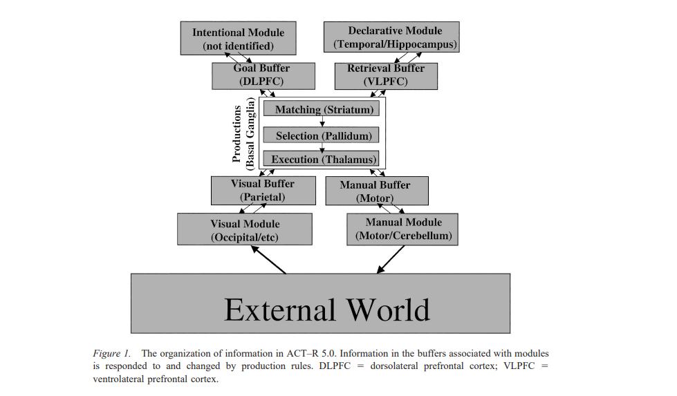

# 探索AGI系列 | 03-01. 认知架构ACT-R理论与源码阅读 - Basic Utilities

---

## 系列前情提要

- 探索AGI系列 | 01. LLM不等于通用人工智能望周知
- 探索AGI系列 | 02. 智能体方法论：Agent智能体 & 认知架构（Cognitive Architecture）

## 前言

读者朋友们好，上一篇《探索AGI系列 | 02. 智能体方法论：Agent智能体 & 认知架构（Cognitive
Architecture》在各个平台都受到了比较大的反响，一方面体现出大家对于本系列的兴趣，另一方面也给了笔者更大的创作动力。因此笔者在忙完工作之余马不停蹄的为大家更新接下来的内容。再上一章末尾，笔者为大家介绍了一下认知模型ACT-R的基础构成，在这一章，我们将更深入的对ACT-R进行庖丁解牛，从理论和代码实现角度剖析ACT-R的思路。理论方面，笔者借鉴了论文：An Integrated Theory of the Mind. 
代码方面笔者阅读的是其python实现--PyACTR。原版实现应当是基于LISP的实现，Python版本与原版略有区别，但不影响我们的目的。

## Recap：ACT-R总览



ACT-R（Adaptive Control of Thought—Rational）是一种认知架构，用于建模人类认知过程和行为。它旨在模拟人类思维和决策的过程，以便研究和理解认知心理学现象。ACT-R包括多个模块，每个模块都有不同的功能，用于模拟特定认知功能。

1. 意图模块 (Intentional Module / Goal Module)
   意图模块负责规划和控制行为。它确定当前任务的目标，协调其他模块的活动，以实现这些目标。意图模块是ACT-R中的执行控制中心。
2. 陈述性模块 (Declarative Module)
   陈述性模块用于存储事实、规则和概念的知识库。这允许模型访问和检索长期记忆中的信息，支持决策和问题解决过程。
3. 视觉模块 (Visual Module)
   视觉模块处理感觉输入，模拟人类的视觉处理过程。它负责感知和理解视觉信息，如物体、场景和符号。
4. 手动模块 (Manual Module)
   手动模块允许模型执行手部动作，例如移动、抓取物体等。它控制模型的运动和互动，模拟身体动作的执行。
5. 生产模块 (Production Module / Procedural System)
   生产模块是ACT-R的核心组成部分之一，用于表示知识和决策。它包括生产规则，描述了条件-动作对。当特定条件满足时，生产规则会触发执行相应的动作，模拟认知任务的决策过程。

ACT-R的相关开发人员定义其为Hybrid模式架构，其Production Module采用了Symbolic思想，简单来说就是一系列If-then语句，不涉及对大脑的模拟。Declarative
Module模块采用了Connectionist的思想，定义了Activation Score来作为记忆是否获取的标准。因而ACT-R整体应该是属于Hybrid。

## 模块详解

在ACT-R认知架构中，有三个关键的"基础建设"单元，它们是：Buffer、Chunk和Productions。这些单元在支持认知任务的执行和模拟中起到了至关重要的角色。

1. Buffer：
Buffer 是ACT-R中用于处理和暂存信息的关键组件。它类似于人类认知中的工作记忆，充当了信息的暂存区域。不同类型的 Buffer 用于处理不同类型的信息，如视觉输入、听觉输入、语音产出等。Buffer 负责接收、处理和传递信息，以支持模型执行感知、记忆、决策和执行等认知功能。

2. Chunk：
Chunk 是ACT-R中的数据结构，用于表示和存储信息。每个 Chunk 包含了一个或多个属性（slots）以及这些属性相关联的值。块用于模拟和存储认知任务中的知识和信息。块可以看作是记忆的基本单元，它们允许模型存储和检索先前的知识，并在决策过程中使用它们。

3. Productions：
Productions 是ACT-R中的规则或指导模型行为的逻辑。它们表示了模型如何根据当前的情境和目标来进行决策和行动。Productions 定义了一系列条件和操作，当满足条件时，模型会执行相关操作。这使得模型能够在不同的情境下做出不同的决策和行动，从而模拟认知过程中的灵活性和适应性。

这三个基础建设单元（Buffer、Chunk和Productions）共同构建了ACT-R认知架构的基础。Buffers 用于接收和传递信息，Chunks 用于存储知识和信息，而Productions 则用于规范模型的行为。它们协同工作，使ACT-R模型能够模拟和执行各种认知任务。

接下来我们将从代码实现角度去理解他们。
### Chunk

Chunk是ACT-R中的信息单位，它是一个包含多个属性-值对的数据结构。每个属性-值对描述了信息的一部分，例如一个Chunk可以表示一个单词，它的属性可以包括"词汇"、"语义"、"频率"等等。Chunk用于表示和存储知识、事实、规则和任务状态。

在ACT-R中，Chunk可以存储在不同的Buffer中，以进行处理和传递。例如，视觉Buffer可以包含一个Chunk，表示一个模型看到的物体，听觉Buffer可以包含一个Chunk，表示听到的话语。Chunk的内容可以被提取、比较和操作，以支持认知任务的执行。

```Python
class Chunk(Sequence):
    """
    ACT-R chunks. Based on namedtuple (tuple with dictionary-like properties).

    For example:
    >>> Chunk('chunktype_example0', value='one')
    chunktype_example0(value= one)
    """

    class EmptyValue(object):
        """
        Empty values used in chunks. These are None values.
        """
        pass
    
    _chunktypes = {}
    _undefinedchunktypecounter = 0
    _chunks = {}

    __emptyvalue = EmptyValue()

    _similarities = {} #dict of similarities between chunks

    def __init__(self, typename, **dictionary):
        self.typename = typename
        self.boundvars = {} #dict of bound variables

        kwargs = {}
        for key in dictionary:

            #change values (and values in a tuple) into string, when possible (when the value is not another chunk)
            if isinstance(dictionary[key], Chunk):
                dictionary[key] = utilities.VarvalClass(variables=None, values=dictionary[key], negvariables=(), negvalues=())

            elif isinstance(dictionary[key], utilities.VarvalClass):
                for x in dictionary[key]._fields:
                    if x in {"values", "variables"} and not isinstance(getattr(dictionary[key], x), str) and getattr(dictionary[key], x) != self.__emptyvalue and not isinstance(getattr(dictionary[key], x), Chunk):
                        raise TypeError("Values and variables must be strings, chunks or empty (None)")

                    elif x in {"negvariables", "negvalues"} and (not isinstance(getattr(dictionary[key], x), collections.abc.Sequence) or isinstance(getattr(dictionary[key], x), collections.abc.MutableSequence)):
                        raise TypeError("Negvalues and negvariables must be tuples")

            elif (isinstance(dictionary[key], collections.abc.Iterable) and not isinstance(dictionary[key], str)) or not isinstance(dictionary[key], collections.abc.Hashable):
                raise ValueError("The value of a chunk slot must be hashable and not iterable; you are using an illegal type for the value of the chunk slot %s, namely %s" % (key, type(dictionary[key])))

            else:
                #create namedtuple varval and split dictionary[key] into variables, values, negvariables, negvalues
                try:
                    temp_dict = utilities.stringsplitting(str(dictionary[key]))
                except utilities.ACTRError as e:
                    raise utilities.ACTRError("The chunk %s is not defined correctly; %s" %(dictionary[key], e))
                loop_dict = temp_dict.copy()
                for x in loop_dict:
                    if x == "negvariables" or x == "negvalues":
                        val = tuple(temp_dict[x])
                    else:
                        try:
                            val = temp_dict[x].pop()
                        except KeyError:
                            val = None
                    temp_dict[x] = val
                dictionary[key] = utilities.VarvalClass(**temp_dict)

            #adding _ to minimize/avoid name clashes
            kwargs[key+"_"] = dictionary[key]
        try:
            for elem in self._chunktypes[typename]._fields:

                if elem not in kwargs:

                    kwargs[elem] = self.__emptyvalue #emptyvalues are explicitly added to attributes that were left out
                    dictionary[elem[:-1]] = self.__emptyvalue #emptyvalues are also added to attributes in the original dictionary (since this might be used for chunktype creation later)

            if set(self._chunktypes[typename]._fields) != set(kwargs.keys()):

                chunktype(typename, dictionary.keys())  #If there are more args than in the original chunktype, chunktype has to be created again, with slots for new attributes
                warnings.warn("Chunk type %s is extended with new attributes" % typename)

        except KeyError:

            chunktype(typename, dictionary.keys())  #If chunktype completely missing, it is created first
            warnings.warn("Chunk type %s was not defined; added automatically" % typename)

        finally:
            self.actrchunk = self._chunktypes[typename](**kwargs)

        self.__empty = None #this will store what the chunk looks like without empty values (the values will be stored on the first call of the relevant function)
        self.__unused = None #this will store what the chunk looks like without unused values
        self.__hash = None, self.boundvars.copy() #this will store the hash along with variables (hash changes if some variables are resolved)
      
    def _asdict(self):
        """
        Create a dictionary out of chunk.
        """
        ...

    def __eq__(self, otherchunk):
        if hash(self) == hash(otherchunk):
            return True
        else:
            return False

    def __getattr__(self, name):
        if hasattr(self.actrchunk, name + "_"):
            return getattr(self.actrchunk, name + "_")
        else:
            raise AttributeError("Chunk has no such attribute")

    def __getitem__(self, pos):
        return re.sub("_$", "", self.actrchunk._fields[pos]), self.actrchunk[pos]

    def __hash__(self):
        ...

    def __iter__(self):
        for x, y in zip(self.actrchunk._fields, self.actrchunk):
            yield re.sub("_$", "", x), y

    def __len__(self):
        return len(self.actrchunk)

    def __repr__(self):
         ...

    def __lt__(self, otherchunk):
        """
        Check whether one chunk is proper part of another (given bound variables in boundvars).
        """
        return not self == otherchunk and self.match(otherchunk, partialmatching=False)

    def __le__(self, otherchunk):
        """
        Check whether one chunk is part of another (given boundvariables in boundvars).
        """
        return self == otherchunk or self.match(otherchunk, partialmatching=False) #actually, the second disjunct should be enough -- TODO: check why it fails in some cases; this might be important for partial matching

    def match(self, otherchunk, partialmatching, mismatch_penalty=1):
        """
        Check partial match (given bound variables in boundvars).
        """
        ...
      
    def removeempty(self):
        """
        Remove slot-value pairs that have the value __emptyvalue, that is, None and 'None'.
      
        Be careful! This returns a tuple with slot-value pairs.
        """
        ...

    def removeunused(self):
        """
        Remove values that were only added to fill in empty slots, using None. 
      
        Be careful! This returns a generator with slot-value pairs.
        """
        ...
```
上面附上Chunk实现的部分代码，其中个别模块笔者忽略了具体的实现。从class的定义来看，Chunk类继承于Sequence类，并且在后面的代码中重载了一些魔法函数（一些软件工程上的优化例如防键值冲突等，与架构关系不大）。从Chunk的定义来看，chunk被定义为type和对应的slots，这点在代码中也有体现，Chunk类在__init__时，输入为typename和一些键值对。Chunk的实例化在代码实现中使用的是一个函数makechunk, 在实例化chunk之前首先需要定义chunktype，这两个函数在下面的实操示例代码中包含了。
```Python
# pyactr.__init__:
from pyactr.chunks import chunktype, makechunk, chunkstring
# 使用pyactr的案例
import pyactr as actr

addition = actr.ACTRModel()

actr.chunktype("countOrder", ("first", "second")) # 定义chunk type

actr.chunktype("add", ("arg1", "arg2", "sum", "count"))

dm = addition.decmem

for i in range(0, 11):
    dm.add(actr.makechunk("chunk"+str(i), "countOrder", first=i, second=i+1)) # 在declarative memory中创建chunk
...
# 定义chunk type
def chunktype(cls_name, field_names, defaults=None):
    """
    Creates type chunk. Works like namedtuple.

    For example:
    >>> chunktype('chunktype_example0', 'value')

    :param field_names: an iterable or a string of slot names separated by spaces
    :param defaults: default values for the slots, given as an iterable, counting from the last element
    """
    if cls_name in utilities.SPECIALCHUNKTYPES and field_names != utilities.SPECIALCHUNKTYPES[cls_name]:
        raise ACTRError("You cannot redefine slots of the chunk type '%s'; you can only use the slots '%s'" % (cls_name, utilities.SPECIALCHUNKTYPES[cls_name]))

    try:
        field_names = field_names.replace(',', ' ').split()
    except AttributeError:  # no .replace or .split
        pass  # assume it's already a sequence of identifiers
    field_names = tuple(sorted(name + "_" for name in field_names))
    for each in field_names:
        if each == "ISA" or each == "isa":
            raise ACTRError("You cannot use the slot 'isa' in your chunk. That slot is used to define chunktypes.")
    try:
        Chunk._chunktypes.update({cls_name:collections.namedtuple(cls_name, field_names, defaults=defaults)}) #chunktypes are not returned; they are stored as Chunk class attribute
    except TypeError:
        Chunk._chunktypes.update({cls_name:collections.namedtuple(cls_name, field_names)}) #chunktypes are not returned; they are stored as Chunk class attribute

# makechunk:
def makechunk(nameofchunk="", typename="", **dictionary):
    """
    Create a chunk.

    Three values can be specified:
    
    (i) the name of the chunk (the name could be used if the chunk appears as a value of other chunks or production rules)
    (ii) its type
    (ii) slot-value pairs.

    For example:
    >>> makechunk(nameofchunk='example0', typename='chunktype_example0', value='one')
    chunktype_example0(value= one)

    This creates a chunk of type chunk1, which has one slot (value) and the value of that slot is one.
    """
    if not nameofchunk:
        nameofchunk = "unnamedchunk"
    if not typename:
        typename = "undefined" + str(Chunk._undefinedchunktypecounter)
        Chunk._undefinedchunktypecounter += 1
    for key in dictionary:
        if isinstance(dictionary[key], Chunk):
            pass
        elif isinstance(dictionary[key], utilities.VarvalClass):
            pass
        else:
            try:
                temp_dict = utilities.stringsplitting(str(dictionary[key]))
            except utilities.ACTRError as e:
                raise utilities.ACTRError("The chunk value %s is not defined correctly; %s" %(dictionary[key], e))
            loop_dict = temp_dict.copy()
            for x in loop_dict:
                if x == "negvariables" or x == "negvalues":
                    val = tuple(temp_dict[x])
                else:
                    try:
                        val = temp_dict[x].pop()
                    except KeyError:
                        val = None
                temp_dict[x] = val
            dictionary[key] = utilities.VarvalClass(**temp_dict)

    created_chunk = Chunk(typename, **dictionary)
    created_chunk._chunks[nameofchunk] = created_chunk
    return created_chunk
```
上述代码中体现了一些`工厂模式`的特征。在工厂模式中，有一个方法（或函数），它创建对象（在这种情况下是“chunks”），而不需要指定将创建的确切对象类别。chunktype根据输入参数cls_name、field_names和defaults创建并返回不同类型的块。被创建的对象（在这种情况下是块）通常被称为“产品”。在上述代码中，产品是collections.namedtuple类的实例，表示块类型。虽然代码不是严格遵循工厂方法模式（因为它不涉及继承或子类），但它展现了一种类似的概念，即根据输入参数创建对象（块类型），而客户端代码无需知道其构建细节。它封装了根据输入参数创建块类型的过程，类似于工厂方法模式封装了对象的创建。综合来看，Chunk 类在代码中既是块类型（chunk type）的定义者，也是块的实例化者。块类型的定义包括了块应该具有的属性，而块的实例则是具体的数据对象，具有这些属性的具体值。这使得代码能够有效地创建和操作不同类型的块，并在模拟 ACT-R 模型时使用它们。

值得注意的一点：一个Chunk块中可以包含`多个`type-slots键值对。根据这个特质，笔者很容易联想到图数据结构中的node attributes。事实上，很多基于ACT-R的实现都采用了图结构。
### Buffer
Buffer是ACT-R中的信息处理单元，类似于短期工作记忆。每个Buffer都有特定的名称，表示不同的认知任务或处理阶段。以下是一些常见的Buffer：

- 视觉缓冲区 (Visual Buffer)：用于处理视觉输入，例如从眼睛接收到的图像信息。它允许模型暂时存储和处理视觉信息，以支持感知和理解。

- 听觉缓冲区 (Auditory Buffer)：用于处理听觉输入，例如听到的声音和语音。它允许模型存储和操作听觉信息，支持语言理解和音频处理。

- 手动缓冲区 (Manual Buffer)：用于处理手动操作，例如按下按钮或移动鼠标。它允许模型暂时存储手动操作的信息，以支持互动和执行动作。

- 陈述性记忆缓冲区 (Declarative Memory Buffer)：陈述性记忆缓冲区用于与长期记忆中的知识进行交互。它允许模型从长期记忆中检索和存储信息，支持记忆和知识的使用。

每个Buffer都可以包含一个或多个Chunk，这些Chunk是信息的基本单位。通过Buffer，ACT-R模型可以在不同的认知任务之间传递、存储和操作信息，从而模拟人类认知过程中的信息处理和转换。
```python
class Buffer(collections.abc.MutableSet):
    """
    Buffer module.
    """

    _BUSY = utilities._BUSY
    _FREE = utilities._FREE
    _ERROR = utilities._ERROR

    def __init__(self, dm=None, data=None):
        self.dm = dm
        self.state = self._FREE #set here but state of buffer instances controlled in productions
        if data == None:
            self._data = set([])
        else:
            self._data = data
        assert len(self) <= 1, "Buffer can carry at most one element"

    @property
    def dm(self):
        """
        Default harvest of goal buffer.
        """
        return self.__dm

    @dm.setter
    def dm(self, value):
        if isinstance(value, collections.abc.MutableMapping) or not value:
            self.__dm = value
        else:
            raise ValueError('The attempted dm value cannot be set; it is not a possible declarative memory')

    def __contains__(self, elem):
        return elem in self._data

    def __iter__(self):
        for elem in self._data:
            yield elem

    def __len__(self):
        return len(self._data)

    def __repr__(self):
        return repr(self._data)

    def add(self, elem):
        """
        Add a chunk into the buffer.

        elem must be a chunk.
        """
        ...

    def discard(self, elem):
        """
        Discard an element without clearing it into a memory.
        """
        self._data.discard(elem)
    
    def show(self, attr):
        """
        Print the content of the buffer.
        """
        ...

    def test_buffer(self, inquiry):
        """
        Is buffer full/empty?
        """
        ...

    def modify(self, otherchunk, actrvariables=None):
        """
        Modify the chunk in Buffer according to the info in otherchunk.
        """
        ...
```
如上是基类Buffer的实现，继承于抽象基类MutableSet，这意味着在Buffer中的元素是会进行去重的。但这不代表Buffer可以存储多个元素，我们通过__init__的最后一行可以知道self._data的长度至多为1，也就是说从Memory中获取多个元素是可以的，如果这多个元素去重后是同一个，则Buffer不会报错。这也是为什么使用Set实现的原因。

同时，Buffer还定义了状态，每个Buffer实例只能进行原子操作，操作过程中实力状态会改成BUSY。

```python
class Buffer(collections.abc.MutableSet):
    ...
    def add(self, elem):
        """
        Add a chunk into the buffer.
   
        elem must be a chunk.
        """
        self._data = set()
        
        if isinstance(elem, chunks.Chunk):
            self._data.add(elem)
        else:
            raise TypeError("Only chunks can be added to Buffer")
```
通过重载的add函数我们可以知道，Buffer中的元素仅可为Chunk, 同时，在向Buffer中添加新元素的时候，会清空之前的值，因为每次调用Buffer.add()时会将self._data重新赋值为新的空集合。
```python
class Buffer(collections.abc.MutableSet):
    ...
    def modify(self, otherchunk, actrvariables=None):
        """
        Modify the chunk in Buffer according to the info in otherchunk.
        """
        if actrvariables == None:
            actrvariables = {}
        elem = self._data.pop()
        try:
            mod_attr_val = {x[0]: utilities.check_bound_vars(actrvariables, x[1]) for x in otherchunk.removeunused()} #creates dict of attr-val pairs according to otherchunk
        except utilities.ACTRError as arg:
            raise utilities.ACTRError("The modification by the chunk '%s is impossible; %s" % (otherchunk, arg))
        elem_attr_val = {x[0]: x[1] for x in elem}
        elem_attr_val.update(mod_attr_val) #updates original chunk with attr-val from otherchunk
        mod_chunk = chunks.Chunk(otherchunk.typename, **elem_attr_val) #creates new chunk

        self._data.add(mod_chunk) #put chunk directly into buffer
        
    def show(self, attr):
        """
        Print the content of the buffer.
        """
        if self._data:
            chunk = self._data.copy().pop()
        else:
            chunk = None
        try:
            print(" ".join([str(attr), str(getattr(chunk, attr))]))
        except AttributeError:
            print(attr)

```
上述代码实现的是对Buffer进行`修改/查看`的逻辑。我们可以看到每次对于Buffer中chunk的修改都是对该`chunk的副本`进行操作。查看时，复制一份原本的数据并pop出来；修改时对副本进行修改然后推回原本的集合。

每个模块都有其对应的Buffer，该模块Buffer类都继承于Buffer，例如Visual Module的buffer为Visual(buffers.Buffer)。`正常情况`下每个module仅有一个Buffer，每个module可以有好几个，例如Declarative Memory可以有多个，在存储的字典中，DM名若有重复，key被定义为`dm_<idx>`.

总结一下Buffer的特点：
- **接口和通信**：Buffer充当了不同模块之间的接口，用于通信和数据传递。

- **唯一性**：每个Buffer有一个唯一的名称，通过该名称引用，如目标缓冲区和检索缓冲区。

- **请求和响应**：Buffer用于向其关联模块发送请求以执行操作，并可以查询其模块的状态。模块通过Buffer回应请求，通常生成事件来执行操作并将结果放入Buffer中。

- **一次只有一个Chunk**：每个Buffer一次只能容纳一个块（Chunk），这个块对所有其他模块可见。

- **块的副本**：当将块放入Buffer时，Buffer会制作该块的副本，任何对Buffer中块的更改都不会影响原始块。

### Productions

**Productions（产生式）** 是 ACT-R 中的重要概念。每个产生式由以下三个主要组成部分构成：

**rule（规则）**：
- 条件部分：一系列模式的逻辑连接，用于匹配当前缓冲区的内容和缓冲区与模块的状态。

**utility（效用）**：
- 表示产生式执行的效用，通常用于衡量执行该产生式的价值或重要性。

**reward（奖励）**：
- 表示执行产生式后的奖励，用于指示执行结果的价值。

当产生式的条件部分满足所有约束时，它可能会被选择执行。一旦执行，将按照定义的操作来执行，并且可以考虑产生的奖励。在ACT-R教程中，您可以找到有关如何指定和使用Productions的更多详细信息。

接下来，我们将深入代码层面，以更好地理解 `Production` 相关类的工作原理。

```python
class Production(collections.UserDict):
    """
    Production rule.
    """

    def __init__(self, rule, utility, reward):
        self.rule = {}
        self.rule['rule'] = rule
        self.rule['utility'] = utility
        self.rule['reward'] = reward

        self.utility = utility
        self.reward = reward

    def __contains__(self, elem):
        return elem in self.rule

    def __iter__(self):
        for elem in self.rule:
            yield elem

    def __len__(self):
        return len(self.rule)

    def __getitem__(self, key):
        return self.rule[key]
    
    def __delitem__(self, key):
        del self.rule[key]

    def __repr__(self):
        txt = ''
        production = self["rule"]()
        utility = self["utility"]
        reward = self["reward"]
        txt += '{}\n==>\n{}'.format(next(production), next(production))
        if utility:
            txt += "\nUtility: {}\n".format(utility)
        if reward:
            txt += "Reward: {}\n".format(reward)
        return txt

    def __setitem__(self, key, value):
        assert key in {"rule", "utility", "reward"}, "The production can set only one of four values -- rule, utility, reward; you are using '%s'" %key
        self.rule[key] = value
```
单条Production继承于collections.UserDict。为什么不使用namedtuple，笔者认为Production需要实现更加自定义化的键值关系，例如：  `__repr__`（Production的复现逻辑）。接下来我们来看多条Productions的类实现：
```python
class Productions(collections.UserDict):
    """
    Production rules.
    """
    
    _undefinedrulecounter = 0

    __DFT_UTILITY = 0
    __DFT_REWARD = None
        
    def __init__(self, *rules):
        self.rules = {}
        for rule in rules:
            try:    
                utility_position = len(inspect.getargspec(rule).args)-inspect.getargspec(rule).args.index('utility')
            except ValueError:
                utility = self.__DFT_UTILITY
            else:
                utility = inspect.getargspec(rule).defaults[0-utility_position]
            try:    
                reward_position = len(inspect.getargspec(rule).args)-inspect.getargspec(rule).args.index('reward')
            except ValueError:
                reward = self.__DFT_REWARD
            else:
                reward = inspect.getargspec(rule).defaults[0-reward_position]
            self.update({rule.__name__: {'rule': rule, 'utility': utility, 'reward': reward}})

        self.used_rulenames = {} #the dictionary of used rulenames, needed for utility learning

    def __contains__(self, elem):
        return elem in self.rules

    def __iter__(self):
        for elem in self.rules:
            yield elem

    def __len__(self):
        return len(self.rules)

    def __getitem__(self, key):
        return self.rules.get(key)
    
    def __delitem__(self, key):
        del self.rules[key]

    def __repr__(self):
        txt = ''
        for rulename in self.rules:
            txt += rulename + '{}\n'.format(self.rules[rulename])
        return txt

    def __setitem__(self, key, value):
        if isinstance(value, collections.abc.MutableMapping):
            self.rules[key] = Production(**value)
        else:
            self.rules[key] = Production(rule=value["rule"], utility=self.__DFT_UTILITY, reward=self.__DFT_REWARD)

    def __collapse__(self, rule1, rule2, slotvals, retrieval):
        """
        Collapses 2 rules into 1.
        """
        ...
        return Production(rule=func, utility=self.__DFT_UTILITY, reward=self.__DFT_REWARD)

    def __rename__(self, name, variables):
        """
        Rename production, so that variable names do not clash. name is used to change the variable name to minimize clash. Returns the production with the new name.
        """
        ... 
        return Production(rule=func, utility=self.__DFT_UTILITY, reward=self.__DFT_REWARD) #Reward and utility are set at dft right now, simplified

    def __substitute__(self, rule, variable_dict, val_dict):
        """
        Substitutes variables in rule1 and rule2 according to the information in the dictionary variable_dict.
        """
        ...
        return Production(rule=func, utility=rule['utility'], reward=rule['reward'])

    def __check_valid_compilation__(self, rule_name1, rule_name2, buffers):
        """
        Check that production compilation is valid. There are several cases in which compilation is blocked because it would result in an unsafe rule (a rule that might differ in its output compared to the original rule1 and rule2 firing one after the other). The function returns True if the production compilation is unsafe and should be stopped.
        """
        ...

    def compile_rules(self, rule_name1, rule_name2, slotvals, buffers, model_parameters):
        """
        Rule compilation.
        """
        ...
        return new_name, re_created
```
在Productions初始化阶段代码定义了一个名为 `Productions` 的自定义类，用于表示一组产生式规则。以下是代码段的流程解释：

1. `Productions` 类继承自 `collections.UserDict`，这意味着它具有字典类的特性，但可以进行自定义扩展。

2. `_undefinedrulecounter` 是一个类属性，用于跟踪未定义的规则数量，初始化为0。

3. `__DFT_UTILITY` 和 `__DFT_REWARD` 是类属性，分别表示默认的效用（utility）和奖励（reward）值。这些默认值将用于规则中未明确指定效用和奖励的情况。

4. 在 `__init__` 方法中，接受了一个可变数量的参数 `*rules`，这表示可以传递多个规则函数作为参数。

5. 在 `__init__` 方法中，通过迭代传递的规则函数（`*rules`）来创建规则字典（`self.rules`）。对于每个规则函数，以下步骤会重复执行：

   - 使用 `inspect.getargspec` 函数来检查规则函数的参数和默认值。
   - 通过查找参数中的 `'utility'` 和 `'reward'` 来确定效用和奖励的位置。
   - 如果规则函数中未找到 `'utility'`，则使用默认效用值 `__DFT_UTILITY`。
   - 如果规则函数中未找到 `'reward'`，则使用默认奖励值 `__DFT_REWARD`。
   - 使用规则函数的名称作为键，将规则函数、效用和奖励的信息存储为字典值，将其添加到 `self.rules` 字典中。

6. 最后，`self.used_rulenames` 初始化为空字典，用于跟踪已使用的规则名称，这在效用学习方面可能会用到。

Productions定义了 `规则编译` 的逻辑。在ACT-R中，**规则编译（Rule Compilation）** 是一种优化技术，用于将高级认知规则翻译成底层的操作指令，以便在模拟中更高效地执行这些规则。这项技术的主要作用如下：

1. **提高模拟效率**：ACT-R模型通常包括许多高级的认知规则，这些规则用于描述认知过程，例如决策、记忆检索等。将这些高级规则翻译成底层操作指令可以显著提高模拟的效率，使模型能够更快速地执行任务。

2. **精确模拟**：规则编译可以确保模拟的行为与实际认知过程更加一致。通过将高级规则转化为底层操作，可以更准确地模拟认知过程中的每个步骤和决策。

3. **支持实验设计**：在ACT-R中进行实验设计时，规则编译可以确保模型在执行任务时遵循与实验一致的步骤和时间表。这有助于研究人员更好地理解和解释实验结果。

4. **提高模型的可解释性**：规则编译将高级规则转化为可执行的操作指令，使模型的行为更容易理解和解释。研究人员可以更清晰地查看模型是如何执行任务的，从而更好地分析模型的行为和决策。
```python
class Productions(collections.UserDict):
    
    ...
    
    def compile_rules(self, rule_name1, rule_name2, slotvals, buffers, model_parameters):
        """
        Rule compilation.
        """
        slotvals = slotvals.copy()

        stop = self.__check_valid_compilation__(rule_name1, rule_name2, buffers)
        if stop:
            return False, False

        #we have to get rid of =, ~= sign
        modified_actrvariables = set()

        #get out variables that should not be clashed
        retrieval = None
        for buff in slotvals:
            if slotvals[buff]:
                if isinstance(slotvals[buff], collections.abc.MutableSequence):
                    retrieval = buff #store which buffer carries retrieval info that can be discarded later
                    #if the retrieval is not gone at the end of rule_name2 -- do not compile!!! -- this catches one case in which rules should not be combined because they might yield unsafe results
                    if buffers[buff]:
                        return False, False
                else:
                    for slot in slotvals[buff]:
                        if slotvals[buff][slot] != None:
                            var = slotvals[buff][slot].variables
                            if var != None:
                                modified_actrvariables.add(var)

        new_2rule = self.__rename__(rule_name2, modified_actrvariables) #rename all variables in rule_name2 to avoid var clashes

        production2 = new_2rule['rule']()
        
        pro2 = next(production2)

        matched, valued = utilities.match(pro2, slotvals, rule_name1, rule_name2)

        new_1rule = self.__substitute__(self[rule_name1], matched, valued)
        
        new_2rule = self.__substitute__(new_2rule, matched, valued)

        for buff in slotvals:
            mod_attr_val = {}
            if slotvals[buff]:
                for elem in slotvals[buff]:
                    varval = utilities.make_chunkparts_with_new_vars(slotvals[buff][elem], matched, valued)
                    mod_attr_val[elem] = varval
                slotvals[buff] = mod_attr_val

        new_rule = self.__collapse__(new_1rule, new_2rule, slotvals, retrieval)
        
        idx = 0
        re_created = "CREATED"
        while True:
            if idx > 0:
                new_name = " ".join([str(rule_name1), "and", str(rule_name2), str(idx)])
            else:
                new_name = " ".join([str(rule_name1), "and", str(rule_name2)])
            if self.__getitem__(new_name):
                pr1 = self[new_name]["rule"]()
                pr2 = new_rule["rule"]()
                if next(pr1) == next(pr2) and next(pr1) == next(pr2):
                    re_created = "RE-CREATED"
                    if model_parameters["utility_learning"]:
                        self[new_name]["utility"] = round(self[new_name]["utility"] + model_parameters["utility_alpha"]*(self[rule_name1]["utility"]-self[new_name]["utility"]), 4)
                    break
                else:
                    idx += 1
            else:
                self[new_name] = new_rule
                break

        return new_name, re_created
```
1. `compile_rules` 方法接受多个参数，其中包括 `rule_name1` 和 `rule_name2`，这是要编译的两个规则的名称，以及其他参数如 `slotvals`、`buffers` 和 `model_parameters`。

2. 在开始编译之前，首先复制了 `slotvals`，以便进行修改而不影响原始数据。

3. 通过调用 `__check_valid_compilation__` 方法来检查编译是否有效，如果不是有效的编译，则返回 `False`。这是一个用于检查编译合法性的内部方法。

4. 在编译之前，代码会处理 `slotvals` 中的变量，确保它们不会与其他变量发生冲突。这包括获取那些不能与其他变量冲突的变量，并检查缓冲区中是否存在与检索相关的信息。如果存在与检索相关的信息，并且在 `rule_name2` 结束时未丢弃，则不进行编译，返回 `False`。

5. 接下来，代码会对 `rule_name2` 中的所有变量进行重命名，以避免变量之间的冲突。

6. 创建 `rule_name2` 的产生式实例，并进行匹配操作，将 `rule_name2` 中的模式与 `slotvals` 进行匹配，以获取匹配和值的信息。

7. 使用匹配和值的信息，替换 `rule_name1` 和 `rule_name2` 中的变量，生成新的规则。

8. 对于 `slotvals` 中的每个缓冲区，将变量值修改为匹配和值后的新值。

9. 最后，将新生成的规则与现有的规则进行比较，以确定是否需要重新创建规则。如果已经存在具有相同规则的规则，则根据模型参数进行效用学习的更新。如果没有相同规则的规则，则将新规则添加到规则集中，并返回新规则的名称。

这段代码实现了规则编译的过程，**用于将两个规则合并成一个规则**，以提高模型的效率和精确性。这个过程包括匹配、替换、重命名和效用学习等步骤，以确保生成的新规则是有效的。

```python

class ProductionRules(object):
    """
    Production knowledge.
    """

    _UNKNOWN = utilities._UNKNOWN
    _PROCEDURAL = utilities._PROCEDURAL
    _EMPTY = utilities._EMPTY
    _RHSCONVENTIONS = utilities._RHSCONVENTIONS
    _LHSCONVENTIONS = utilities._LHSCONVENTIONS
    _INTERRUPTIBLE = utilities._INTERRUPTIBLE

    def __init__(self, rules, buffers, dm, model_parameters):
        self.__actrvariables = {} #variables in a fired rule
        self.rules = rules
        self.ordered_rulenames = sorted(rules.keys(), key=lambda x: rules[x]['utility'], reverse=True) #rulenames ordered by utilities -- this speeds up rule selection when utilities are used

        self.last_rule = None #used for production compilation
        self.last_rule_slotvals = {key: None for key in buffers} #slot-values after a production; used for production compilation
        self.current_slotvals = {key: None for key in buffers} #slot-values after a production; used for production compilation
        self.compile = [] #information for compilation

        self.buffers = buffers #dict of buffers

        self.procs = [] #list of active processes

        self.dm = dm #list of (submodules of) memories

        self.env_interaction = set() #set interacting with environment (pressed keys)

        self.model_parameters = model_parameters

    def procedural_process(self, start_time=0):
        ...

    def compile_rules(self):
        ...

    def update(self, RHSdictionary, time):
        ...

    def extra_test(self, name, tested, test, temp_actrvariables, time):
        ...

    def clear(self, name, cleared, optional, temp_actrvariables, time, freeing=True):
        ...

    def execute(self, name, executed, executecommand, temp_actrvariables, time):
        ...

    def modify(self, name, modified, otherchunk, temp_actrvariables, time):
        ...

    def modify_request(self, name, modified, otherchunk, temp_actrvariables, time):
        ...

    def overwrite(self, name, updated, otherchunk, temp_actrvariables, time):
        ...

    def visualencode(self, name, visualbuffer, chunk, temp_actrvariables, time, extra_time, site):
        ...

    def retrieveorset(self, name, updated, otherchunk, temp_actrvariables, time):
        ...

    def retrieve(self, name, retrieval, otherchunk, temp_actrvariables, time):
        ...

    def automatic_search(self, name, visualbuffer, stim, time):
        ...

    def automatic_buffering(self, name, visualbuffer, stim, time):
        ...

    def visualshift(self, name, visualbuffer, otherchunk, temp_actrvariables, time):
        ...

    def visualcontinue(self, name, visualbuffer, otherchunk, temp_actrvariables, time, extra_time, site):
        ...

    def motorset(self, name, motorbuffer, otherchunk, temp_actrvariables, time):
        ...

    def motorcontinue(self, name, motorbuffer, otherchunk, temp_actrvariables, time, time_presses):
        ...

    def LHStest(self, dictionary, actrvariables, update=False):
        ...

    def test(self, submodule_name, tested, testchunk, temp_actrvariables):
        ...

    def query(self, submodule_name, tested, testdict, temp_actrvariables):
        ...

```
`ProductionRules` 类是一种用于处理和管理产生式规则的 Python 类。这个类的主要作用是在一个认知体系架构中实现产生式系统的操作和规则处理。`ProductionRules` 类可以通过多种方式来管理 `Productions`。

1. **添加和删除规则**：`ProductionRules` 类可以提供方法，允许用户添加新的产生式规则或删除现有的规则。这样，用户可以根据需要灵活地管理规则库。例如，可以实现 `add_rule` 和 `remove_rule` 方法来添加和删除规则。

2. **规则执行**：`ProductionRules` 类可以提供方法，用于执行匹配的产生式规则。这包括在系统状态满足规则条件时触发规则的执行。执行规则时，可以调用 `Productions` 类的相关方法来执行规则中定义的操作。

3. **规则选择**：`ProductionRules` 类可以维护规则的排序列表，以便系统可以根据规则的效用（utility）选择要执行的规则。这种选择可以基于规则的条件和其他上下文信息。选择规则后，可以调用 `Productions` 类的方法来执行规则。

4. **规则编译**：如果需要，`ProductionRules` 类可以提供编译规则的功能，将规则转化为更高效的内部表示形式。编译后的规则可以更快地执行。这种编译可以涉及将规则中的条件和动作转化为适合系统执行的形式。这一过程可以在规则执行之前进行。

5. **规则检索**：`ProductionRules` 类可以支持按名称或其他属性检索规则的功能。这使得用户可以根据需要检索和查看规则，以了解规则库的内容。

6. **规则管理**：除了添加和删除规则外，`ProductionRules` 类还可以支持规则的编辑和更新。这允许用户对现有规则进行修改，以适应系统的需求。

`ProductionRules` 类可以充当规则库的中央管理器，负责规则的管理、执行和编译。通常情况下被用于对`已经使用过的Productions`进行管理，一般在Simulation阶段进行实例化。Productions是在Model初始化阶段就会被实例化成为一个class member.

这里附上一段Model的代码：
```python
class ACTRModel(object):
    """
    ACT-R model, running ACT-R simulations.

    model_parameters and their default values are:
    {"subsymbolic": False,
    "rule_firing": 0.05,
    "latency_factor": 0.1,
    "latency_exponent": 1.0,
    "decay": 0.5,
    "baselevel_learning": True,
    "optimized_learning": False,
    "instantaneous_noise" : 0,
    "retrieval_threshold" : 0,
    "buffer_spreading_activation" : {},
    "spreading_activation_restricted" : False,
    "strength_of_association": 0,
    "association_only_from_chunks": True,
    "partial_matching": False,
    "mismatch_penalty": 1,
    "activation_trace": False,
    "utility_noise": 0,
    "utility_learning": False,
    "utility_alpha": 0.2,
    "motor_prepared": False,
    "strict_harvesting": False,
    "production_compilation": False,
    "automatic_visual_search": True,
    "emma": True,
    "emma_noise": True,
    "emma_landing_site_noise": False,
    "eye_mvt_angle_parameter": 1,
    "eye_mvt_scaling_parameter": 0.01
    }

    environment has to be an instantiation of the class Environment.
    """

    MODEL_PARAMETERS = {"subsymbolic": False,
                "rule_firing": 0.05,
                "latency_factor": 0.1,
                "latency_exponent": 1.0,
                "decay": 0.5,
                "baselevel_learning": True,
                "optimized_learning": False,
                "instantaneous_noise" : 0,
                "retrieval_threshold" : 0,
                "buffer_spreading_activation" : {},
                "spreading_activation_restricted" : False,
                "strength_of_association": 0,
                "association_only_from_chunks": True,
                "partial_matching": False,
                "mismatch_penalty": 1,
                "activation_trace": False,
                "utility_noise": 0,
                "utility_learning": False,
                "utility_alpha": 0.2,
                "motor_prepared": False,
                "strict_harvesting": False,
                "production_compilation": False,
                "automatic_visual_search": True,
                "emma": True,
                "emma_noise": True,
                "emma_landing_site_noise": False,
                "eye_mvt_angle_parameter": 1, #in LispACT-R: 1
                "eye_mvt_scaling_parameter": 0.01, #in LispACT-R: 0.01, but dft rule firing -- 0.01
                }

    def __init__(self, environment=None, **model_parameters):

        self.chunktype = chunks.chunktype
        self.chunkstring = chunks.chunkstring

        self.visbuffers = {}

        start_goal = goals.Goal()
        self.goals = {"g": start_goal}

        self.__buffers = {"g": start_goal}

        start_retrieval = declarative.DecMemBuffer()
        self.retrievals = {"retrieval": start_retrieval}
        
        self.__buffers["retrieval"] = start_retrieval
        
        start_dm = declarative.DecMem()
        self.decmems = {"decmem": start_dm}
        '''
        这里是Productions的初始化
        '''
        self.productions = productions.Productions() 
        self.__similarities = {}

        self.model_parameters = self.MODEL_PARAMETERS.copy()

        try:
            if not set(model_parameters.keys()).issubset(set(self.MODEL_PARAMETERS.keys())):
                raise(utilities.ACTRError("Incorrect model parameter(s) %s. The only possible model parameters are: '%s'" % (set(model_parameters.keys()).difference(set(self.MODEL_PARAMETERS.keys())), set(self.MODEL_PARAMETERS.keys()))))
            self.model_parameters.update(model_parameters)
        except TypeError:
            pass

        self.__env = environment

   ...
   
   def simulation(self, realtime=False, trace=True, gui=True, initial_time=0, environment_process=None, **kwargs):
   """
   Prepare simulation of the model
   
   This does not run the simulation, it only returns the simulation object. The object can then be run using run(max_time) command.
   
   realtime: should the simulation be run in real time or not?
   trace: should the trace of the simulation be printed?
   gui: should the environment appear on a separate screen? (This requires tkinter.)
   initial_time: what is the starting time point of the simulation?
   environment_process: what environment process should the simulation use?
   The environment_process argument should be supplied with the method environment_process of the environment used in the model.
   kwargs are arguments that environment_process will be supplied with.
   """
   
   if len(self.decmems) == 1:
      for key in self.__buffers:
          self.__buffers[key].dm = self.decmem #if only one dm, let all buffers use it
   elif len([x for x in self.decmems.values() if x]) == 1:
      for key in self.__buffers:
          if not self.__buffers[key].dm:
              self.__buffers[key].dm = self.decmem #if only one non-trivial dm, let buffers use it that do not have a dm specified
   
   decmem = {name: self.__buffers[name].dm for name in self.__buffers\
          if self.__buffers[name].dm != None} #dict of declarative memories used; more than 1 decmem might appear here
   
   self.__buffers["manual"] = motor.Motor() #adding motor buffer
   
   if self.__env:
      self.__env.initial_time = initial_time #set the initial time of the environment to be the same as simulation
      if self.visbuffers:
          self.__buffers.update(self.visbuffers)
      else:
          dm = list(decmem.values())[0]
          self.__buffers["visual"] = vision.Visual(self.__env, dm) #adding vision buffers
          self.__buffers["visual_location"] = vision.VisualLocation(self.__env, dm) #adding vision buffers
   
   self.productions.used_rulenames = {} # remove any previously stored rules for utility learning

   '''
   这里是ProductionRules的初始化
   '''
   used_productions = productions.ProductionRules(self.productions, self.__buffers, decmem, self.model_parameters) 
   
   chunks.Chunk._similarities = self.__similarities
   
   return simulation.Simulation(self.__env, realtime, trace, gui, self.__buffers, used_productions, initial_time, environment_process, **kwargs)
```

## 本章小结

本章开启了对于ACT-R结构上的详细解剖，笔者结合代码实现为大家讲解了ACT-R中的三个基础模块Chunk, Buffer, Production。
下一章节开始我们将剖析五大主体模块：`意图模块, 陈述性模块, 视觉模块, 手动模块, 生产模块`。其中，生产模块在本章介绍Production时已经略微提到。
这篇文章代码浓度可能比较高，如果阅读起来有点吃力的话可以先看一下ACT-R的综述性论文，笔者把链接放在这：

希望文章能给大家带来收获，如果通过阅读本文有收获的话，还请`点赞关注收藏`一波，您的支持就是我的动力！我们下期再见！（假期应该能更新比较快把）